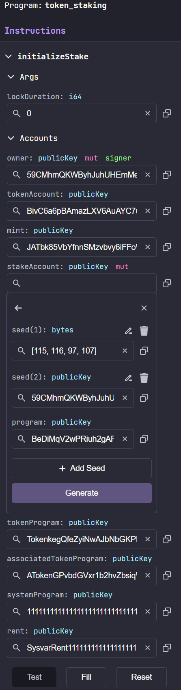
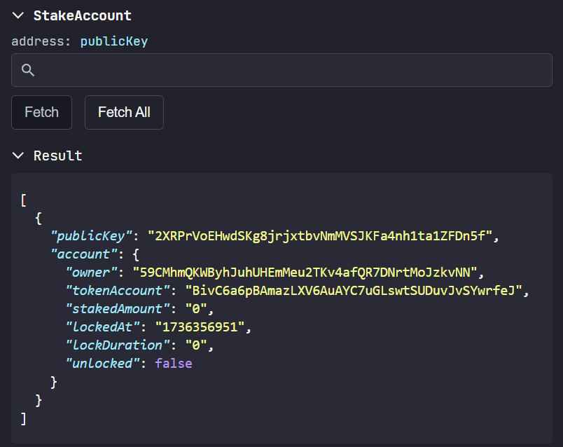
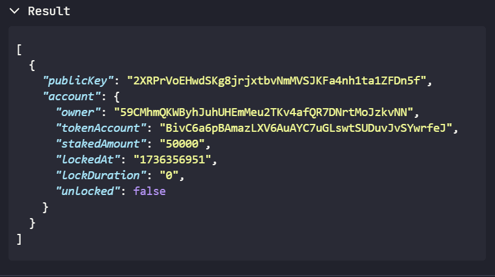
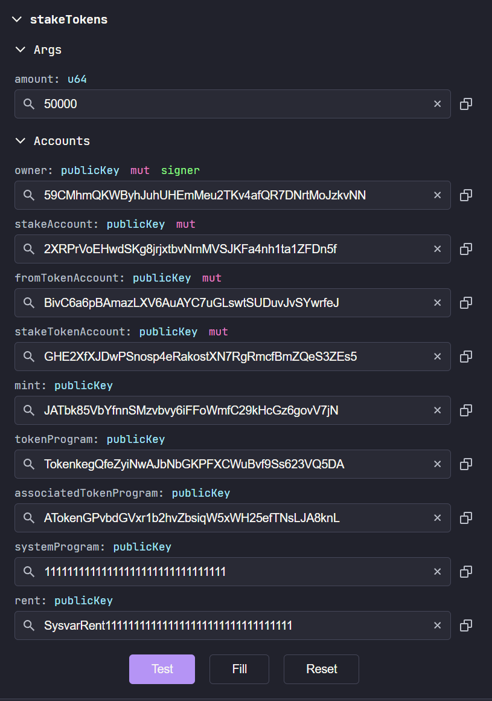
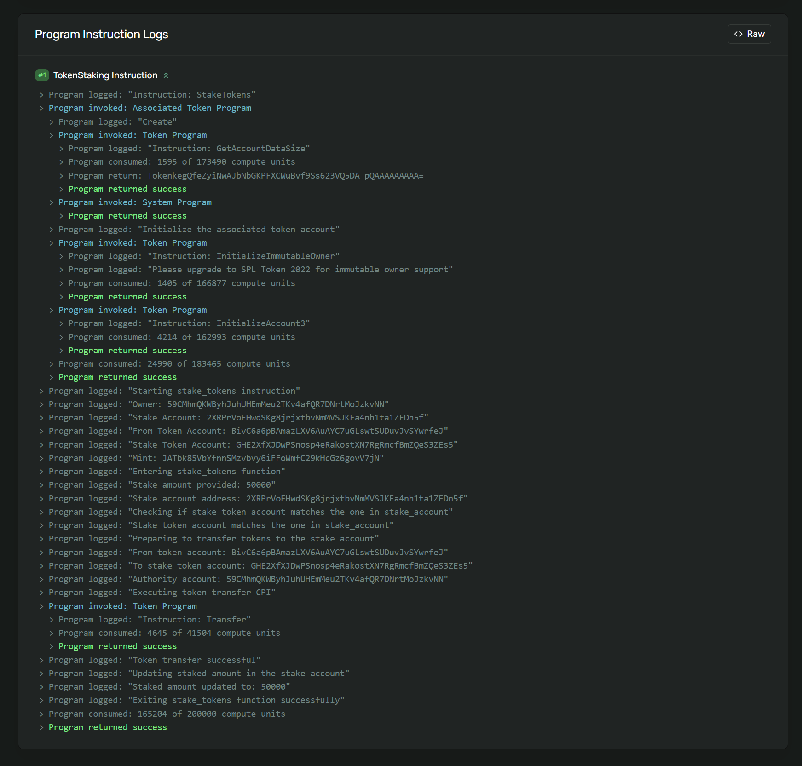
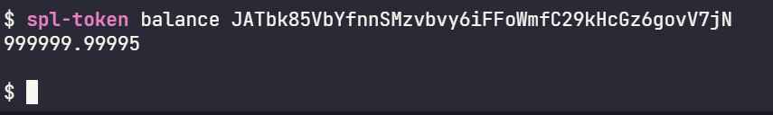
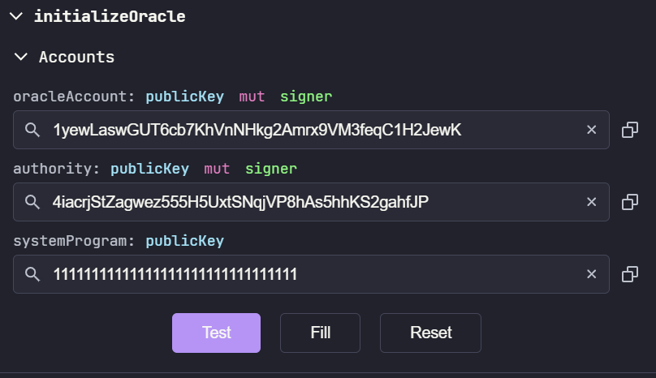
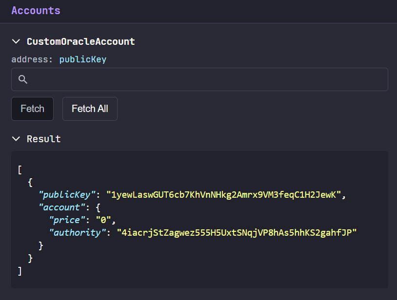
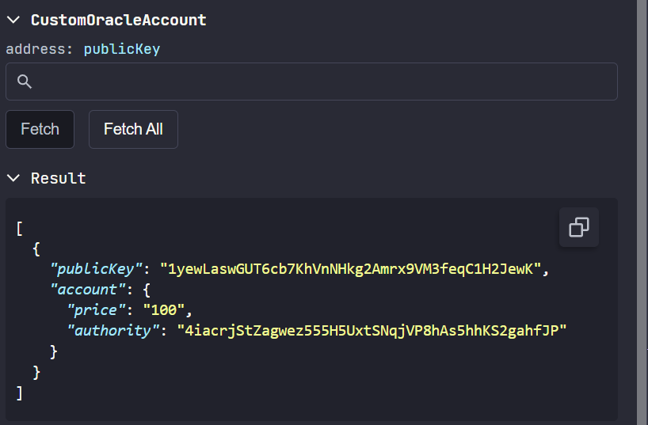
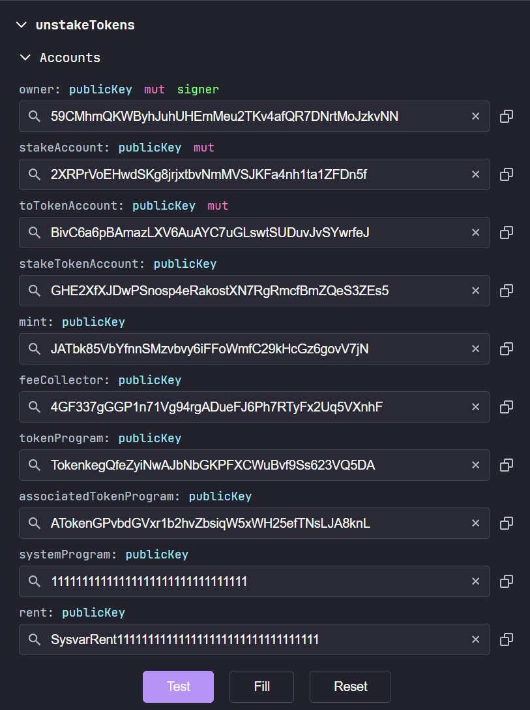

# Notes for new deployment

## Setup / Deploy

1. Setup new key on ledger
2. Connect ledger to phantom wallet (chrome works, need to fix firefox for some reason)
3. Note ledger wallet address: 6UdWSsJiTA65XQ6hSgMNqM9FM4s8v8AD8ZYYUk95QztE
    - on Devnet airdrop 5-10 SOL
4. Update program id
5. Export program id
6. Build and deploy program
    - Deployment at minimum leaves wallet with 3.39 SOL mid deploy. 5.59 SOL with running program
7. Initialize and Push IDL
    - Leaves program with 5.58681848 SOL

## Account and Token Setup for Testing

> We will create three wallets, do this for testing only!

- One for minting the token (token owner)
- One to represent the rewards account (rewards sender)
- One to represent the user (staking user)

1. Create 3 new wallets and save the key pairs
2. Airdrop all three accounts 0.5 SOL minimum, or send them from your testing keypair
3. select the token owner
4. Create token
   
    ```bash
    $ spl-token create-token
    Loading SPL Token CLI...
    Success.

    Creating token JATbk85VbYfnnSMzvbvy6iFFoWmfC29kHcGz6govV7jN

    Address:  JATbk85VbYfnnSMzvbvy6iFFoWmfC29kHcGz6govV7jN
    Decimals:  9
    
    Signature: NEr6Uf4U89gqKr8PkghsXpBXjNWoxDWaoUKCLbofuhEpW1J88Cf1guwNUM8g8kRENSgRChLrtXeHaBm33QKNWMh
    ```

5. Create a token account for your address. Note your address of the token account

    ```bash
    $ spl-token create-account JATbk85VbYfnnSMzvbvy6iFFoWmfC29kHcGz6govV7jN
    Creating account 4GF337gGGP1n71Vg94rgADueFJ6Ph7RTyFx2Uq5VXnhF

    Signature: 2ic9q36JVS84qf76PbVzSfbwkidttkFcAfnHkpYTyqF3iWXKQcaJaHzV3kA4WdzaU43i5nJUSQx7SEXsRTdb2AR9
    ```

6. Mint tokens to your *token* account (step 5 `Creating Account ...`)

    ```bash
    spl-token mint JATbk85VbYfnnSMzvbvy6iFFoWmfC29kHcGz6govV7jN 100000000000 4GF337gGGP1n71Vg94rgADueFJ6Ph7RTyFx2Uq5VXnhF
    Minting 100000000000 tokens
    Token: JATbk85VbYfnnSMzvbvy6iFFoWmfC29kHcGz6govV7jN
    Recipient: 4GF337gGGP1n71Vg94rgADueFJ6Ph7RTyFx2Uq5VXnhF

    Signature: 26yH2akDS9VkMfmue5FC3abh4hNaBbhXozB3xvQx7avs7ze3VtTLvjLuMiYwxTFyy72XcuxJViLqQVGikfaL3kg2

    $ 
    ```

7. Create token accounts for your other two wallets. Note their token accounts

    ```bash
    spl-token create-account <TOKEN_MINT_ADDRESS> --owner <RECIPIENT_ADDRESS>
    ```

    ```bash
    $ spl-token create-account JATbk85VbYfnnSMzvbvy6iFFoWmfC29kHcGz6govV7jN --owner FvMCEhb34W3HRJQWFbAu2YgEyFfeWVDjb4qUFFFsKQmn
    Creating account 4fbAGBRKTc2nNPXdS9ke1g4HQqcg5fYY6UwHs13ZQyR2

    Signature: 4hwUk1sLViRT9QhJrnGreAK9axtnwDtYsrXaEKjMVKSwiqNZPM8AZaVGGdxuMskEfLMTUhwKFhDAHmTCDMEXx1nw
    $ spl-token create-account JATbk85VbYfnnSMzvbvy6iFFoWmfC29kHcGz6govV7jN --owner 59CMhmQKWByhJuhUHEmMeu2TKv4afQR7DNrtMoJzkvNN
    Creating account BivC6a6pBAmazLXV6AuAYC7uGLswtSUDuvJvSYwrfeJ

    Signature: 4Pq9ZRDCnqDkm6gQMAgwPmJPM45C1zemEcKjUnBgi1TZ1h9UGQU1LukdzWmx3RPa3QRUvkNvCR5xsp4YJogyPAsU
    ```

8. Transfer the tokens to their token account from the token owner

    ```bash
    $ spl-token transfer <TOKEN_MINT> <AMOUNT> <RECIPIENT ATA>
    ```

    ```bash
    $ spl-token transfer JATbk85VbYfnnSMzvbvy6iFFoWmfC29kHcGz6govV7jN 25000000 4fbAGBRKTc2nNPXdS9ke1g4HQqcg5fYY6UwHs13ZQyR2
    Transfer 25000000 tokens
    Sender: 4GF337gGGP1n71Vg94rgADueFJ6Ph7RTyFx2Uq5VXnhF
    Recipient: 4fbAGBRKTc2nNPXdS9ke1g4HQqcg5fYY6UwHs13ZQyR2

    Signature: 45ekGE2Z8WnNSFzqKfYcJJmJwwG6AGcpYuZPWwS8CkLcRTRTXmXp4LbUaqtDFH3R9ns4ahEMNevtE24bRByZa2Q5

    $ spl-token transfer JATbk85VbYfnnSMzvbvy6iFFoWmfC29kHcGz6govV7jN 1000000 BivC6a6pBAmazLXV6AuAYC7uGLswtSUDuvJvSYwrfeJ
    Transfer 1000000 tokens
    Sender: 4GF337gGGP1n71Vg94rgADueFJ6Ph7RTyFx2Uq5VXnhF
    Recipient: BivC6a6pBAmazLXV6AuAYC7uGLswtSUDuvJvSYwrfeJ
    spl-token transfer JATbk85VbYfnnSMzvbvy6iFFoWmfC29kHcGz6govV7jN 1000000 BivC6a6pBAmazLXV6AuAYC7uGLswtSUDuvJvSYwrfeJ
    Signature: 5zCPrMsUhDd5zZ1GXekhFQ87Xu2Q5NzaqeTfhFwzjqbSrdWs4qLANP3HjJdxwzkk4priDLX46zG11GigSwm9FsDL 
    ```


## Account Verification (Testing Only)

1. Get account Balances (switch accounts between running)

```bash
# Token mint
$ spl-token balance JATbk85VbYfnnSMzvbvy6iFFoWmfC29kHcGz6govV7jN
18420744073.709551615
# Rewards Account
$ spl-token balance JATbk85VbYfnnSMzvbvy6iFFoWmfC29kHcGz6govV7jN
25000000
# Staking Test User
$ spl-token balance JATbk85VbYfnnSMzvbvy6iFFoWmfC29kHcGz6govV7jN
1000000
```

## Running the program flow

### 1. Initialize Stake

1. Select the staking user
2. Select the `initializeStake` idl interaction
3. Set the parameters as listed
   
| Item | Value | Derivation |
| --- | --- | --- |
| lockDuration | `i64 x >= 0` | Number of miliseconds to until possible unstake |
| owner | `::pubkey` | Signer of the transaction |
| tokenAccount | `::pubkey` | Token account, checks owner = signer and mint = mint |
| mint | `::pubkey` | The mint address of the token being staked. |
| stakeAccount | `::pubkey` | PDA derived address -- `[b'stak', owner.pubkey, program_id]` |
| tokenProgram | `TokenkegQfeZyiNwAJbNbGKPFXCWuBvf9Ss623VQ5DA` | Token Program Key |
| associatedTokenProgram | `ATokenGPvbdGVxr1b2hvZbsiqW5xWH25efTNsLJA8knL` | Assocaited Token Program Key |
| systemProgram | `11111111111111111111111111111111` | System Program. |
| rent | `SysvarRent111111111111111111111111111111111` | Rent Variable. |

#### 1. Success

```
Testing 'initializeStake'...
✅  Test 'initializeStake' passed.
```





### 2. Start Stake

1. Select the staking user
2. Select the `stakeTokens` idl interaction
3. Set the parameters as listed

| Item | Value | Derivation |
| --- | --- | --- |
| amount | `i64 x >= 0, x<= total tokens` | Amount to stake |
| owner | `::pubkey` | Signer of the transaction |
| stakeAccount | `::pubkey` | PDA derived address -- `[b'stak', owner.pubkey, program_id]`, should be initialized by step 1 |
| fromTokenAccount | `::pubkey` | Token account, checks owner = signer and mint = mint |
| stakeTokenAccount | `ata-derived::pubkey::from(stakeAccount)` | Token account, checks owner = signer and mint = mint |
| mint | `::pubkey` | The mint address of the token being staked. |
| tokenProgram | `TokenkegQfeZyiNwAJbNbGKPFXCWuBvf9Ss623VQ5DA` | Token Program Key |
| associatedTokenProgram | `ATokenGPvbdGVxr1b2hvZbsiqW5xWH25efTNsLJA8knL` | Assocaited Token Program Key |
| systemProgram | `11111111111111111111111111111111` | System Program. |
| rent | `SysvarRent111111111111111111111111111111111` | Rent Variable. |

#### 1a. Getting SPL Token account for stake account

This is needed to be done on the client side before attempting to stake

```bash
$ spl-token address --verbose --token JATbk85VbYfnnSMzvbvy6iFFoWmfC29kHcGz6govV7jN --owner 2XRPrVoEHwdSKg8jrjxtbvNmMVSJKFa4nh1ta1ZFDn5f
Wallet address: 2XRPrVoEHwdSKg8jrjxtbvNmMVSJKFa4nh1ta1ZFDn5f
Associated token address: GHE2XfXJDwPSnosp4eRakostXN7RgRmcfBmZQeS3ZEs5
```

[72,65,77,61,72,64,5f,61,63,63,6f,75,6e,74]

#### 2a. Success

```txt
Testing 'stakeToken'...
✅  Test 'stakeToken' passed.
```







#### 2b. Getting balance after staking

` spl-token get balance token-address `




### 3. Setup Oracle (Possibly Step 0)

1. Create new wallet (oracle)
2. Save wallet-keypair
3. Run initialize oracle

| Item | Value | Derivation |
| --- | --- | --- |
| oracleAccount | `oracle_account::pubkey` | Oracle account key |
| authority | `program_owner::pubkey` | Owner of the program |
| systemProgram | `11111111111111111111111111111111` | System Program.|






### 4. Update Price (Continuously)

1. Invoke with new price

| Item | Value | Derivation |
| --- | --- | --- |
| price | `x >= 0: u64` | price to set in the program |
| oracleAccount | `oracle_account::pubkey` | Oracle account key |
| authority | `program_owner::pubkey` | Owner of the program |

Program price will be updated after this call.



### 5. Check Staking Conditions (User) `checkUnlockConditions`

1. Select staking user account


| Item | Value | Derivation |
| --- | --- | --- |
| owner | `::pubkey` | Signer of the transaction |
| stakeAccount | `::pubkey` | PDA derived address -- `[b'stak', owner.pubkey, program_id]`, should be initialized by step 1 |
| oracleAccount | `::pubkey` | Account to check against |
| tokenMint | `::pubkey` | The mint address of the token being staked. |

### 6. Destake tokens

[TX Link](https://explorer.solana.com/tx/3KFkvu3FMPYRKL4UFMXPiroRDzagy6oENoj8VLTyWN9AwazsVxvqDdo5S5G8jKdzsaNcJJRwnqWoTnWeSuQS9FwY?cluster=devnet)



## TODOs:

- [] Ensure users can't stake more, or that the amount adds
- [x] Ensure that the authority's owner is the program owner
- [x] Quality of life checks for positive balances
- [x] Optional Tip Account
- [] Add stake rewards time limit
- [] Add logic to ensure people can't stake and unstake to take rewards multiple times (stake open time. destake close time.)
- [] Add logic to ensure staking / unstaking is a one time thing 